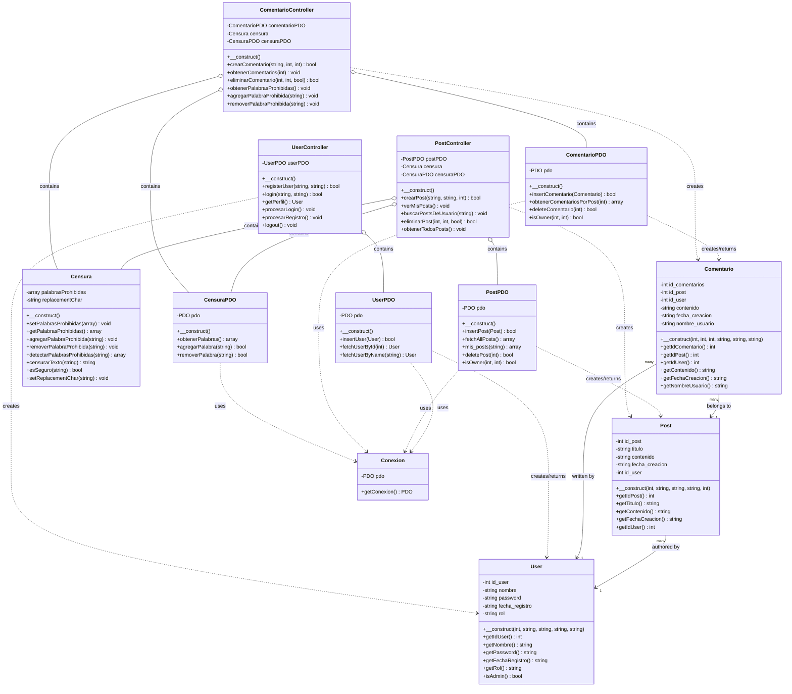

# Diagrama UML - BlogPersonal

Este diagrama muestra la arquitectura completa del proyecto BlogPersonal con todas las clases, sus relaciones y dependencias.

## Diagrama Visual

## Código Mermaid del Diagrama

## Explicación de la Arquitectura

### Capas del Sistema

#### 1. **Models (Capa de Dominio)**
- **`User`**: Representa los usuarios del sistema con autenticación y roles
- **`Post`**: Representa las publicaciones del blog
- **`Comentario`**: Representa los comentarios en los posts
- **`Censura`**: Lógica de negocio para censurar palabras prohibidas

#### 2. **PDO (Capa de Acceso a Datos)**
- **`UserPDO`**: Operaciones CRUD para usuarios
- **`PostPDO`**: Operaciones CRUD para posts
- **`ComentarioPDO`**: Operaciones CRUD para comentarios
- **`CensuraPDO`**: Gestión de palabras prohibidas en BD
- **`Conexion`**: Singleton para la conexión a la base de datos

#### 3. **Controllers (Capa de Lógica de Negocio)**
- **`UserController`**: Gestión de autenticación, registro y perfil de usuarios
- **`PostController`**: Gestión de posts con censura automática
- **`ComentarioController`**: Gestión de comentarios y administración de palabras prohibidas

### Tipos de Relaciones

- **Asociación (→)**: Relaciones de negocio entre entidades del dominio
- **Dependencia (..)**: Una clase usa otra temporalmente (parámetros, valores de retorno)
- **Composición (o--)**: Una clase contiene otra como parte integral de su funcionamiento

### Flujo de Datos Típico

1. **Controllers** reciben peticiones HTTP desde las vistas
2. **Controllers** usan **PDO** para acceso a datos
3. **PDO** usa **Conexion** para interactuar con la Base de Datos
4. **PDO** crea y retorna objetos **Models**
5. **Controllers** procesan **Models** y aplican lógica de negocio
6. **Controllers** retornan respuestas JSON o redirecciones

### Características Principales

- **Separación de Responsabilidades**: Cada capa tiene un propósito específico
- **Sistema de Censura**: Integrado en PostController y ComentarioController
- **Gestión de Permisos**: Sistema de roles (user/admin) en User
- **Sesiones**: Manejo de autenticación mediante PHP sessions
- **Validación**: Sanitización de entradas con htmlspecialchars
- **Password Hashing**: Seguridad con password_hash y password_verify
